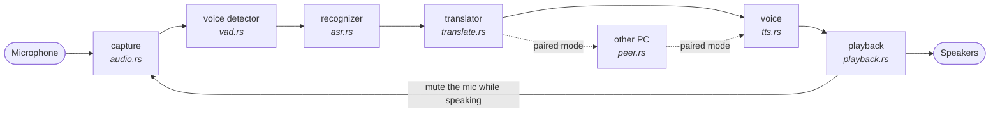
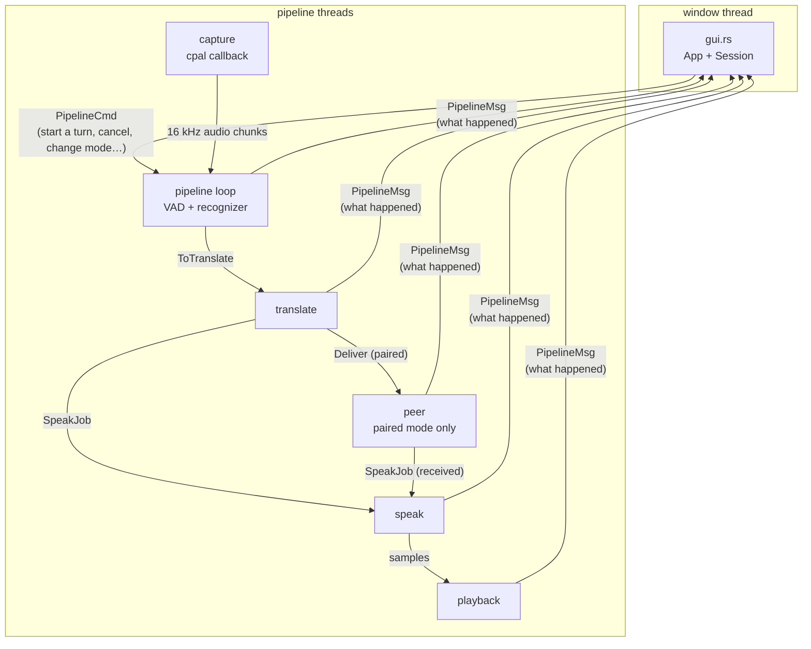

# How cnverc is built

A guide for a developer who is new to this code. It explains what each part does, how the parts
connect, how to find the cause of a problem, and how to make the common kinds of change.

- To set cnverc up or use it, read [README.md](README.md).
- For *why* things are the way they are (design decisions, build internals, measurements), read
  [TECHNICAL.md](TECHNICAL.md).
- The specification the code was built against is [SPEC.md](SPEC.md). Its §2 hard rules are
  repeated in [CLAUDE.md](CLAUDE.md).

You need to read some Rust, but not much: most of the code is plain functions, structs and
channels between threads, with no async and no macros of our own.

---

## 1. The big picture

cnverc is one program with no helpers and no servers. It listens to a microphone, works out
what was said, translates it, and says the translation out loud, all on the local machine:



Each box is a model or a device. The models live in files under `models/`, next to the
program. They're found at startup by reading each model folder's `engine.toml`
(see [section 5](#5-configuration-and-models)).

Two front ends drive the same pipeline:

- **The window** (`gui.rs`), which is what people use.
- **`--listen`** (`listen.rs`), which runs the pipeline in a terminal, for logs and quick
  checks.

### Threads and channels

Everything slow runs on its own thread, so a slow step never freezes the window or makes the
microphone drop audio. Threads talk only through channels:



Two message types carry everything the window knows and does:

- **`PipelineCmd`** (window → pipeline): start or end a turn, cancel, change mode, connect or
  disconnect a peer.
- **`PipelineMsg`** (pipeline → window): loading progress, a turn starting or ending, what was
  heard (`Final`), its translation (`Translated`), speech starting and ending, peer and floor
  changes, errors.

The window never touches a model or a device. It sends commands and redraws from messages.
That's why most of the window's logic (`gui::Session`) can be unit-tested without opening a
window.

---

## 2. One turn, end to end

In "Take turns" mode (press Space, speak, press Space again), this is what happens:

```mermaid
sequenceDiagram
    actor You
    participant GUI as gui.rs (window)
    participant P as pipeline.rs (loop)
    participant Mic as audio.rs + vad.rs
    participant ASR as asr.rs
    participant TR as translate thread
    participant SP as speak thread
    participant PL as playback.rs

    You->>GUI: Space
    GUI->>P: PipelineCmd::BeginTurn
    P->>Mic: open the microphone
    P-->>GUI: TurnStarted  (banner: RECORDING)
    Mic->>P: audio chunks; the VAD marks where speech is
    You->>GUI: Space
    GUI->>P: PipelineCmd::EndTurn
    P->>Mic: close the microphone
    P-->>GUI: TurnEnded  (banner: PROCESSING)
    P->>ASR: finish_turn → trim silence → transcribe
    P-->>GUI: Final (what was heard)
    P->>TR: ToTranslate
    TR-->>GUI: Translated
    TR->>SP: SpeakJob
    SP->>PL: synthesised samples
    PL-->>GUI: SpeakingStarted … SpeakingEnded  (banner: READY)
```

Where each part lives:

- **The key:** `gui::App::ui` takes it out of egui's input before any widget sees it
  (`take_turn_key`), debounces it (`TurnKey`), and `handle_turn_key` decides begin or end.
- **The loop:** `pipeline::run` is one long loop. It handles commands first, then reads audio
  whenever the microphone is open.
- **The end of a turn:** `finish_turn` closes the microphone and uses the VAD's segments to
  trim silence at both ends (`trim_and_split`). It also splits turns longer than 25 seconds,
  because Whisper only hears 30 at a time.
- **Recognition:** `Stage::handle` transcribes the utterance, sends `Final`, and queues it for
  translation. The queue is `try_send`: if translation falls behind, the utterance is reported
  as not translated rather than blocking the microphone.
- **Translation:** `spawn_translator`'s thread translates with `translate_one`, then hands the
  text to the speaker (or, in paired mode, to the peer thread).
- **Speech:** `spawn_speaker`'s thread picks the voice, synthesises, and queues the samples in
  `Player`.

### How the other modes differ

| Mode | What changes |
|---|---|
| **Listen continuously** | The microphone stays open. The VAD cuts each utterance at a pause, and each goes through `Stage::handle` on its own. There are no turns. |
| **Take turns** | As above: the microphone is open only between the two key presses, and closed (the device released) otherwise. |
| **Shared machine** | Like Take turns, but there are two keys. The key pressed builds a `shared::Direction` (which language to recognise, which to translate into, which voice), sent as `PipelineCmd::BeginSharedTurn`. The direction travels with the turn, so each turn can go a different way. Only Whisper is allowed, because only Whisper can be told the language. |
| **Paired** | Two PCs. A turn needs the **floor**, a token only one PC holds at a time. `Pipeline::send` gives the key to the peer thread, which asks the other PC and sends `BeginTurn` to the pipeline only when the other PC grants it. Translations go to the other PC instead of the local voice. What arrives from the other PC is spoken locally, in the language it says it is in. |

---

## 3. The modules

Every file in `src/`, in the order data flows through them. **Rules** are things that will
break something if you change them without care.

### Starting up

**`main.rs`:** where the program starts.
- Reads the command line (`cli.rs`), finds the program's folder (`paths::app_root`), starts
  logging, loads `cnverc.toml`, and hands over to the window, `--listen`, `--report` or
  `--devices`.
- Also holds `print_devices` and `init_logging`, which writes to `logs/` next to the program.

**`cli.rs`:** turns command-line arguments into a `Command`. It's small on purpose; the
controls belong in the window.

**`paths.rs`:** every path cnverc uses, all built from `app_root()`, the folder the program is
in.
- **Rule:** never use the working directory, `%APPDATA%`, `~/.cache`, or a `dirs` crate.
  cnverc must run from any folder it's copied to (SPEC §2.4).

**`config.rs`:** `cnverc.toml`.
- `Config::load` reads it. Every section has defaults, so an older file still loads.
- `Config::save_selections` writes the window's choices back with `toml_edit`, keeping the
  user's comments and layout.
- **Rule:** every struct uses `deny_unknown_fields`, so a misspelt key is an error rather than
  silently ignored. A new key must be declared, with a default. See
  [section 6](#add-a-cnverctoml-setting).

**`models.rs`:** model discovery ("the filesystem is the index").
- `discover` reads every folder under `models/asr/` and `models/tts/` that has an
  `engine.toml`, and returns an `Entry` for each: `Loaded(Engine)`, or `Failed` with the reason.
- An `Engine` knows its name, backend (Whisper, Parakeet, VITS/Piper), languages and files, and
  whether each file is present (`enabled()`).
- **Rule:** model files keep their published names. `engine.toml` says which file is which.

**`report.rs`:** prints the `--report` table from discovery.

### Listening

**`audio.rs`:** microphones and speakers.
- `list_input_devices` and `list_output_devices` feed the device pickers.
- `spawn_capture` opens a microphone on its own thread and sends 16 kHz mono audio chunks down
  a channel.
- **Rule:** audio is resampled to 16 kHz mono here and only here. Everything after this
  assumes it.

**`vad.rs`:** the voice activity detector (Silero, through sherpa-onnx).
- A `Segmenter` is fed chunks and returns `Segment`s, each a stretch of speech with its start
  time.
- It keeps a 600 ms **pre-roll** (the audio just before speech was detected), because shorter
  pre-roll clipped the first word.
- `reset(origin)` keeps timestamps on the capture's timeline after the microphone is closed and
  reopened.

**`asr.rs`:** speech recognition (the recognizer).
- `load` builds an `AsrEngine` from an `Engine`. `SegmentAsr::transcribe(pcm, language)` turns
  one utterance into text.
- Two implementations exist:
  - **Parakeet** (`NemoTransducerAsr`) detects the language itself and ignores the language
    argument.
  - **Whisper** (`WhisperAsr`) must be told the language, and keeps one recognizer per language,
    because building one loads the model, which takes seconds.
- `StreamAsr` is a placeholder for Milestone 8 (streaming recognition).
- **Rule:** Whisper pads every utterance to 30 seconds, so a short utterance costs about as
  much as a long one. Timings are always shown with the utterance's length.

**`compare.rs`** and **`ring.rs`:** the recognizer comparison (`--compare`, or "Compare
recognizers" in the window) runs every installed recognizer on the same utterance. `ring.rs`
keeps the last 20 utterances. **`wav.rs`** writes utterances to WAV files (`--wav`) and reads
them in tests.

### Translating and speaking

**`translate.rs`:** translation with a Qwen3 model (a `.gguf` file) through llama.cpp, in
process.
- `LlamaTranslator::translate(text, source, target)` builds a prompt that only asks for a
  translation, runs the model, and cleans the answer (`clean`).
- `language_name` maps codes to names ("es" → "Spanish") for the prompt.
- **Rule:** three guards reject a bad answer rather than let it be captioned and spoken:
  1. an echo of the input;
  2. a recitation of the prompt;
  3. an answer far longer than the input.
  Each was found in a live session. Don't remove one without a replacement.

**`tts.rs`:** speech synthesis (Piper voices, through sherpa-onnx).
- `Voice::load(engine)` and `Voice::speak(text)` do the work.
- `for_language` picks the first installed voice for a language.

**`playback.rs`:** the speakers, and the **half-duplex gate**.
- `Player` plays queued samples.
- The `Gate` closes while cnverc is speaking and for 150 ms afterwards. While it's closed, the
  pipeline throws away microphone audio, so cnverc never hears and re-translates its own voice.
- `PlaybackControl` lets the pipeline cut a reply off when someone takes a turn
  (`begin_turn`), release held replies (`end_turn`), or stop everything (`stop`, used by
  Escape).

### The pipeline and its front ends

**`pipeline.rs`:** ties everything together, and is the biggest file.
- `Pipeline::start` spawns the threads and returns a handle. `Pipeline::send` delivers a
  `PipelineCmd`, routing it to the peer thread when paired.
- `run` loads the models (reporting progress with `PipelineMsg::Loading`), then loops. Inside:
  `open_turn` and `finish_turn` (turns), `Stage::handle` (recognise one utterance),
  `spawn_translator` and `spawn_speaker` (the other two threads), and `choose_voice`.
- **Cancelling** (Escape, in Shared mode) moves a *generation* counter on. The translate and
  speak threads drop any job from an older generation.
- **Rule:** never block the pipeline thread on another thread. Use `try_send`, and report what
  couldn't be done as a `PipelineMsg`.

**`listen.rs`:** the `--listen` front end. It prints messages and stops after `--seconds`. It
always listens continuously and never pairs, because a terminal has no turn key or Connect
button.

**`gui.rs`:** the window (egui), in two halves:
- **`Session`**: everything the window knows, changed only by `Session::apply(PipelineMsg)`.
  It has no egui in it and is unit-tested, including `shared_press`, the Shared-mode "one
  person at a time" rule.
- **`App`**: drawing and input. `ui()` takes the turn keys first, then draws the panels:
  `settings_panel`, `peer_panel`, and either `captions` or, in Shared mode, `shared_view`
  (two columns).
- **Rules:**
  - Don't remove a turn key from egui's `keys_down`: egui uses it to tell a held key from a
    new press, and removing it made a held Space flip turns on and off.
  - Arrow keys are taken only when no text box has focus (`text_edit_focused`).
  - On Windows the window uses DirectX 12, with Windows' built-in shader compiler.
- `shared.rs`: the Shared-mode direction rule. `direction(side, …)` returns which language to
  recognise, which to translate into, which voice, or why that side can't take a turn. It's
  pure and fully tested.

### Paired mode (two PCs)

**`wire.rs`:** the messages between two PCs: one JSON object per line over TCP (`Hello`,
`Utterance`, `FloorRequest`/`Grant`/`Release`, `Ping`/`Pong`, `Bye`).
- **Rule:** everything received is untrusted. `decode` limits lengths, refuses non-UTF-8 and
  unknown protocol versions, and strips control characters. Received text is only shown and
  spoken, never obeyed.

**`floor.rs`:** the floor token as a state machine with no sockets.
- The microphone opens only when the other PC grants the floor.
- No answer in 2 seconds fails the turn, visibly.
- If both PCs ask at once, the name that sorts first wins.

**`peer.rs`:** the connection, on its own threads: listening, dialling, the `Hello` handshake,
one reader per connection, pings every 2 seconds, and "gone" after 6 seconds of silence.
- It also produces the firewall diagnostic, and turns floor decisions into actions.
- **Rule:** addresses are IP only. A name is never looked up, because looking one up could
  reach a public DNS server (SPEC §2).

**`discovery.rs`:** the optional "Found on this network" list, a UDP broadcast on port 47801.
Typing the address always works without it.

---

## 4. Rules that keep cnverc working

These come from SPEC §2 and from problems that were found and fixed. Each is cheap to keep and
expensive to break.

| Rule | Why |
|---|---|
| **No internet, ever.** No downloads, update checks or DNS lookups at runtime. | cnverc must work with the network unplugged. Local sockets between two PCs are fine. |
| **Paths only from `paths::app_root()`.** | The whole folder can be copied anywhere, including to another PC, and still work. |
| **Windows: static CRT, and llama.cpp without `openmp`** (`.cargo/config.toml`, `Cargo.toml`). | The program must run on a PC with nothing installed, with no Visual C++ redistributable. |
| **Linux: sherpa-onnx as a shared library** (a target-specific entry in `Cargo.toml`). | The ready-made static Linux library crashes when a model loads. Keep this Linux-only. |
| **Windows: DirectX 12 with the FXC shader compiler** (`gui::graphics_setup`). | The default compiler picked up another program's old `dxcompiler.dll` from PATH, and the window failed to open. |
| **Keep the three translation guards.** | Each stops a caption and a voice from saying something nobody said. |
| **Keep the turn key in egui's `keys_down`.** | Removing it turned a held key into many presses. |
| **Resample only in `audio.rs`.** | Everything downstream assumes 16 kHz mono. |
| **`cargo fmt`, `cargo clippy --all-targets -- -D warnings`, `cargo test`** clean at every commit. | It keeps problems small and found early. |
| **No `unwrap()` / `expect()` after startup**, and every file error names the full path. | Errors must reach the user as sentences, not as crashes. |

---

## 5. Configuration and models

**`cnverc.toml`** sits next to the program and holds only the user's choices: recognizer,
languages, devices, mode, speech, pairing, and the Shared-mode sides.
- The window saves changes as they're made (`save_selections`), editing the file in place so
  comments survive.
- A file that doesn't parse is never overwritten: the error is shown instead.

**Models** live under `models/`, one folder per model, each keeping its published file names:

```
models/
  vad/silero_vad.onnx              the voice detector
  asr/<recognizer>/engine.toml     plus its files
  mt/<one>.gguf                    exactly one translator
  tts/<voice>/engine.toml          plus its files and espeak-ng-data/
```

An `engine.toml` looks like this:

```toml
name = "Whisper large-v3-turbo (int8)"   # shown in the window
kind = "segment"                         # whole utterances ("stream" is Milestone 8)
backend = "whisper"                      # whisper | nemo_transducer | vits
languages = ["es", "en", "de"]           # what it can recognise or speak

[files]                                  # role = file name; roles depend on the backend
encoder = "turbo-encoder.int8.onnx"
decoder = "turbo-decoder.int8.onnx"
tokens  = "turbo-tokens.txt"
```

The only keys allowed are `name`, `kind`, `backend`, `languages`, `data_dir` and `files`.
Anything else makes the model show as broken, with the reason.

---

## 6. How to…

### Add a language

1. Make sure a recognizer lists it: Whisper lists most languages. Add the code to that
   `engine.toml`'s `languages` if it's missing.
2. Add a voice that speaks it (below).
3. Add its name to `translate::language_name` (`src/translate.rs`). Otherwise the translation
   prompt says "into ar" instead of "into Arabic", which works worse.
4. Test a sentence each way with `--listen`, and check the log.

### Add a voice

1. Download a Piper voice from the
   [sherpa-onnx TTS releases](https://github.com/k2-fsa/sherpa-onnx/releases/tag/tts-models).
2. Extract it into `models/tts/<its folder name>/`.
3. Copy an existing voice's `engine.toml` and change `name`, `languages` and the `model` file
   name.
4. Run `--report`: it should say `ok`. No code change is needed. It appears in Shared mode's
   voice pickers, and `for_language` uses it if it's the first voice for its language.

### Add a `cnverc.toml` setting

1. Add the field to the right struct in `config.rs`, with a default in its `impl Default`.
2. If the window changes it, add a `set(…)` line to `save_selections`.
3. Add it, commented, to the `cnverc.toml` template in the repository root, and to SPEC §7.
4. Add a test like `a_file_from_before_shared_mode_still_loads`: an old file must still load.

### Add a pipeline message and show it

1. Add the variant to `PipelineMsg` (`pipeline.rs`) and send it where it happens.
2. Handle it in `gui::Session::apply`, storing what the window needs in `Session`, then draw it
   in `App`.
3. Add a `Session` test in `gui.rs`'s tests module.
4. If `listen.rs` should print it, add a match arm there.

### Add a recognizer backend

1. Add a variant to `models::AsrBackend`, and its name to the `engine.toml` parser in
   `models.rs`.
2. Implement `SegmentAsr` for it in `asr.rs`, following `NemoTransducerAsr`, and add it to
   `asr::load`.
3. If it can be told the language, Shared mode can use it: allow it in `shared::direction`.

### Change a key

The Space key is `[mode] turn_key` in `cnverc.toml`. The Shared-mode keys are
`[shared] left_key` and `right_key`. The names are egui's (`ArrowLeft`, `Space`, `F1`, …).
No code change is needed.

---

## 7. Troubleshooting, for developers

### Symptom → where to look

| Symptom | Look in |
|---|---|
| A model shows DISABLED or broken | `--report`; `models.rs` (which files `engine.toml` names) |
| No microphone or speaker listed | `--devices`; `audio.rs` |
| The level meter doesn't move | The wrong input device; the log's "input level" lines, every 5 s |
| "Nothing recognised" | Play the utterance back with `--listen --wav`; `vad.rs` thresholds in `cnverc.toml` `[vad]` |
| Wrong words | `--compare` to try the other recognizer; for Shared mode, check "transcribing as" in the log |
| "Not translated: …" | `translate.rs`: which guard refused it, named in the message |
| No voice | "No voice installed for …" in the settings; `tts::for_language`; the Shared column's warning |
| cnverc translates its own voice | The half-duplex gate: "Mute the microphone while speaking" must be on with speakers (`playback.rs`) |
| The window won't open | The log's last lines; on Windows, `gui::graphics_setup` |
| Pairing problems | The pairing panel's message; `peer.rs` `diagnose`; the log's `paired mode:` lines |
| A Shared-mode key does nothing | That column's status or reason; `Session::shared_press`; a focused text box |

### Logs

- Everything is logged to `logs/cnverc.log.<date>` next to the program, and to the console
  window.
- For more detail, start cnverc from a terminal with `RUST_LOG=debug` (Git Bash:
  `RUST_LOG=debug ./cnverc.exe`), or narrow it to one module, as in
  `RUST_LOG=info,cnverc::peer=debug`.
- Lines to know:
  - `utterance N: … ms`, then `transcribing as "es"`, then the text: recognition.
  - `[es] … [en] … (N ms to translate)`: translation.
  - `speaking …: N ms to first audio`: speech.
  - `turn started` / `turn ended` / `turn cancelled`: turns.

### Trying the window without touching your settings

Copy the program into a scratch folder with its own `cnverc.toml` and empty
`models/{asr,tts,mt,vad}` folders. The window opens, and nothing you change touches your real
settings. For a full test, point it at the real models with a Windows junction:

```
mklink /J <scratch>\models <cnverc>\target\release\models
```

Remove it afterwards with `rmdir`, which removes only the link. **Don't** delete the scratch
folder with a tool that follows links while the junction is there.

### Tests that need real models or audio

Most tests run with `cargo test` and need nothing. The ones marked `#[ignore]` need the models,
recordings or a loopback audio device, and say how to run them in their doc comments.
TECHNICAL.md has the list. For example:

```bash
CNVERC_TEST_MODELS=/abs/path/target/release/models CNVERC_TEST_WAV_ES=/abs/path/es-16k.wav cargo test --release -- --ignored --nocapture alternates
```

With a virtual audio cable (VB-Audio on Windows), cnverc can be tested end to end with no one
talking: play a recording into the cable's input and set cnverc's microphone to its output.

---

## 8. Building and testing

```bash
./setup.sh                                   # the full build, as a user does it
cargo build                                  # a quick debug build (put models in target/debug/)
cargo fmt
cargo clippy --all-targets -- -D warnings
cargo test
```

- Windows needs the Build Tools' CMake on PATH for a plain `cargo build` (`setup.sh` finds it).
  Close cnverc before rebuilding: a running program can't be replaced ("Access is denied").
- On Linux, set `SHERPA_ONNX_LIB_DIR` to the library `build-sherpa-linux.sh` built (it prints
  the path), and use `-j2` on smaller machines.

What the tests cover, in outline:

| Area | Tests |
|---|---|
| Config | old and new files load; saving keeps comments; unknown keys are refused |
| Models | `engine.toml` parsing; missing files; broken entries |
| Pipeline | turn trimming and splitting; the level meter |
| Translation | cleaning; the three guards; language names |
| Window logic | `Session` for every mode, the turn key, Shared mode's rules |
| Shared mode | the direction rule, voice fallback, refusals |
| Paired mode | the wire protocol and hostile input; the floor; two or three peers talking over loopback |
