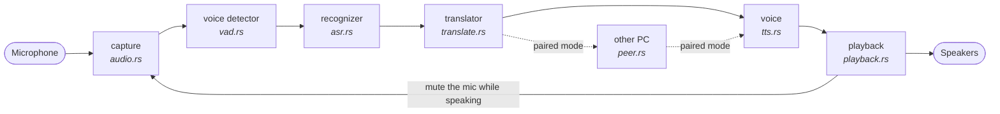
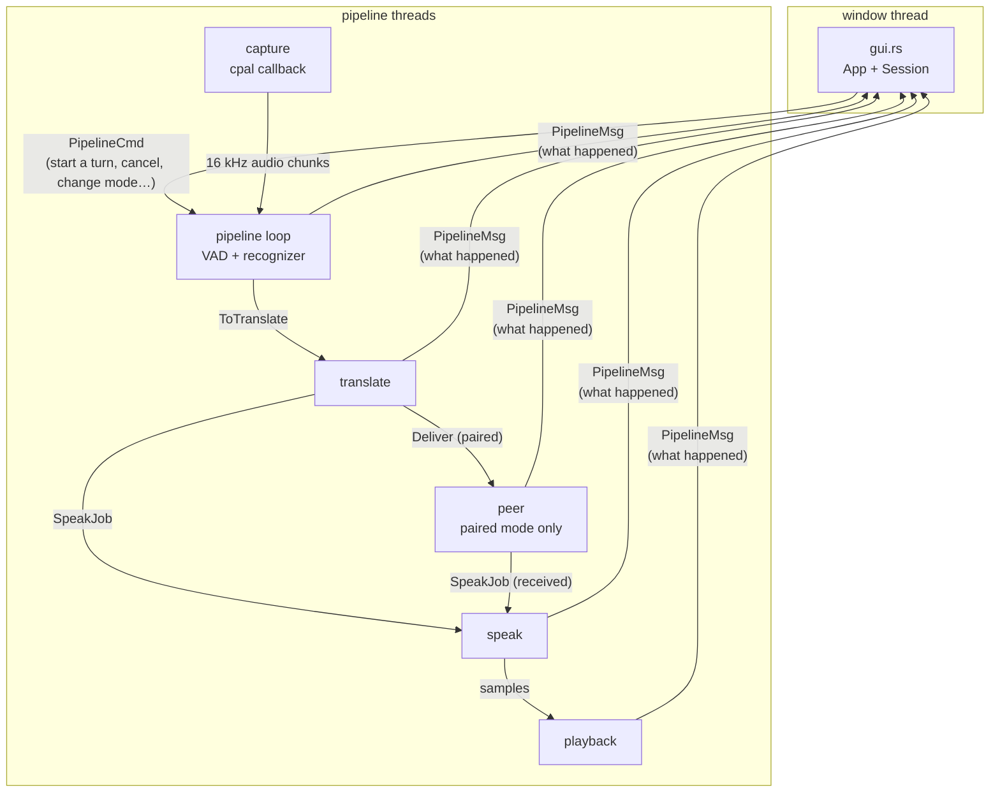

# How Volis is built

A guide for a developer who is new to this code. It explains what each part does, how the parts
connect, how to find the cause of a problem, and how to make the common kinds of change.

- To set Volis up or use it, read [README.md](README.md) and [USE-CASES.md](USE-CASES.md).
- For the models (what each does, `engine.toml`, how to add one), read [MODELS.md](MODELS.md).
- For *why* things are the way they are (design decisions, build internals, measurements), read
  [TECHNICAL.md](TECHNICAL.md).
- The specification the code was built against is [SPEC.md](SPEC.md). Its §2 hard rules are
  repeated in [CLAUDE.md](CLAUDE.md).

You need to read some Rust, but not much: most of the code is plain functions, structs and
channels between threads, with no async and no macros of our own.

---

## 1. The big picture

Volis is one program with no helpers and no servers. It listens to a microphone, works out
what was said, translates it, and says the translation out loud, all on the local machine:


```mermaid
flowchart LR
    mic([Microphone]) --> capture[capture<br/><i>audio.rs</i>]
    capture --> vad[voice detector<br/><i>vad.rs</i>]
    vad --> asr[recognizer<br/><i>asr.rs</i>]
    asr --> mt[translator<br/><i>translate.rs</i>]
    mt --> speak[voice<br/><i>tts.rs</i>]
    speak --> play[playback<br/><i>playback.rs</i>]
    play --> spk([Speakers])
    mt -. paired mode .-> peer[other PC<br/><i>peer.rs</i>]
    peer -. paired mode .-> speak
    play -- "mute the mic while speaking" --> capture
```

Each box is a model or a device. The models live in files under `models/`, next to the
program. They're found at startup by reading each model folder's `engine.toml`
(see [MODELS.md](MODELS.md)).

Two front ends drive the same pipeline:

- **The window** (`gui.rs`), which is what people use.
- **`--listen`** (`listen.rs`), which runs the pipeline in a terminal, for logs and quick
  checks.

### Threads and channels

Everything slow runs on its own thread, so a slow step never freezes the window or makes the
microphone drop audio. Threads talk only through channels:


```mermaid
flowchart TB
    subgraph window thread
        gui[gui.rs<br/>App + Session]
    end
    subgraph pipeline threads
        cap[capture<br/>cpal callback]
        pipe[pipeline loop<br/>VAD + recognizer]
        tr[translate]
        sp[speak]
        pl[playback]
        peer[peer<br/>paired mode only]
    end
    gui -- "PipelineCmd<br/>(start a turn, cancel, change mode…)" --> pipe
    cap -- "16 kHz audio chunks" --> pipe
    pipe -- "ToTranslate" --> tr
    tr -- "SpeakJob" --> sp
    tr -- "Deliver (paired)" --> peer
    peer -- "SpeakJob (received)" --> sp
    sp -- "samples" --> pl
    pipe & tr & sp & pl & peer -- "PipelineMsg<br/>(what happened)" --> gui
```

Two message types carry everything the window knows and does:

- **`PipelineCmd`** (window → pipeline): start or end a turn, cancel, change mode, connect or
  disconnect a peer.
- **`PipelineMsg`** (pipeline → window): loading progress, a turn starting or ending, what was
  heard (`Final`), its translation (`Translated`), speech starting and ending, peer and floor
  changes, errors.

The window never touches a model or a device. It sends commands and redraws from messages.
That's why most of the window's logic (`gui::Session`) can be unit-tested without opening a
window.

---

## 2. One turn, end to end

In "Take turns" mode (press Space, speak, press Space again), this is what happens:

```mermaid
sequenceDiagram
    actor You
    participant GUI as gui.rs (window)
    participant P as pipeline.rs (loop)
    participant Mic as audio.rs + vad.rs
    participant ASR as asr.rs
    participant TR as translate thread
    participant SP as speak thread
    participant PL as playback.rs

    You->>GUI: Space
    GUI->>P: PipelineCmd::BeginTurn
    P->>Mic: open the microphone
    P-->>GUI: TurnStarted  (banner: RECORDING)
    Mic->>P: audio chunks; the VAD marks where speech is
    You->>GUI: Space
    GUI->>P: PipelineCmd::EndTurn
    P->>Mic: close the microphone
    P-->>GUI: TurnEnded  (banner: PROCESSING)
    P->>ASR: finish_turn → trim silence → transcribe
    P-->>GUI: Final (what was heard)
    P->>TR: ToTranslate
    TR-->>GUI: Translated
    TR->>SP: SpeakJob
    SP->>PL: synthesised samples
    PL-->>GUI: SpeakingStarted … SpeakingEnded  (banner: READY)
```

Where each part lives:

- **The key:** `gui::App::ui` takes it out of egui's input before any widget sees it
  (`take_turn_key`), debounces it (`TurnKey`), and `handle_turn_key` decides begin or end.
- **The loop:** `pipeline::run` is one long loop. It handles commands first, then reads audio
  whenever the microphone is open.
- **The end of a turn:** `finish_turn` closes the microphone and uses the VAD's segments to
  trim silence at both ends (`trim_and_split`). It also splits turns longer than 25 seconds,
  because Whisper only hears 30 at a time.
- **Recognition:** `Stage::handle` transcribes the utterance, sends `Final`, and queues it for
  translation. The queue is `try_send`: if translation falls behind, the utterance is reported
  as not translated rather than blocking the microphone.
- **Translation:** `spawn_translator`'s thread translates with `translate_one`, then hands the
  text to the speaker (or, in paired mode, to the peer thread).
- **Speech:** `spawn_speaker`'s thread picks the voice, synthesises, and queues the samples in
  `Player`.

### How the other modes differ

| Mode | What changes |
|---|---|
| **Listen continuously** | The microphone stays open. The VAD cuts each utterance at a pause, and each goes through `Stage::handle` on its own. There are no turns. |
| **Take turns** | As above: the microphone is open only between the two key presses, and closed (the device released) otherwise. |
| **Shared machine** | Like Take turns, but there are two keys, and each side has its own recognizer and voice. The key pressed builds a `shared::Direction` (which recognizer, which language to recognise, which to translate into, which voice), sent as `PipelineCmd::BeginSharedTurn`. The direction travels with the turn, so each turn can go a different way. [In depth below](#shared-machine-mode-in-depth). |
| **Paired** | Two PCs. A turn needs the **floor**, a token only one PC holds at a time. `Pipeline::send` gives the key to the peer thread, which asks the other PC and sends `BeginTurn` to the pipeline only when the other PC grants it. Translations go to the other PC instead of the local voice. What arrives from the other PC is spoken locally, in the language it says it is in. [In depth below](#paired-mode-in-depth). |

### Shared machine mode, in depth

Two people, one PC, a key each. The design brief is in
[docs/plans/shared-machine-mode.md](docs/plans/shared-machine-mode.md); per-side recognizers
and dialects came later ([docs/plans/dialect-per-side.md](docs/plans/dialect-per-side.md)).

- **The direction rule** is `shared::direction`, pure and tested. Given which side pressed, it
  returns that side's recognizer (`recognizer_for`: the one set in `[shared] left_asr` /
  `right_asr`, or the best match from `models::rank`), the language to recognise (that
  side's), the language to translate into (the other side's), and the voice, or the reason
  there can be no turn. Warnings ride along in `Resolved`: Parakeet is allowed, but because it
  decides the language itself and ignores the one it's given, the side shows a note saying so.
- **Recognizers are loaded up front.** Starting Shared mode, or changing a picker, sends
  `PipelineCmd::PrepareShared`. `prepare_shared` loads each side's recognizer into the
  `Recognizers` set (the main one plus an `extra` map), builds Whisper's per-language decoder
  (`SegmentAsr::prepare`), and reports each side with `PipelineMsg::SharedSide`. A side that
  fails says so in its column, and the other keeps working. A model chosen for both sides is
  loaded once. Memory in use is logged after each load.
- **The language travels with the turn.** The `Direction` rides on the `Turn`, then
  `ToTranslate`, then `SpeakJob`, so the recognizer, translator and speaker take the language
  and voice from the job, not from the settings. Every utterance logs
  `transcribing as "<lang>" with "<model>"`. If the language were lost, Whisper would guess, be
  right most of the time, and hide the bug.
- **Whisper keeps a recognizer per language.** Its language is fixed when its recognizer is
  built, and building one loads the model, which takes seconds. `WhisperAsr` keeps one per
  language used, at the cost of a second copy of the model in memory (about 1 GB for turbo
  int8). sherpa-onnx 1.13.8 can change the language in place
  (`SherpaOnnxOfflineRecognizerSetConfig`), but no Rust crate binds it. If one does, the copy
  can go. Whisper is told only the language part of a variety (`es`, never `es-MX`), and logs
  that too.
- **One at a time** is `gui::Session::shared_press`, egui-free and tested: the same key ends
  its turn, the other key is ignored during a turn, and both are ignored while the turn is
  being processed or spoken. The microphone is closed between turns.
- **Escape** sends `PipelineCmd::Cancel`: a turn being recorded is discarded, the generation
  counter moves on so older translation and speech jobs are dropped, and
  `PlaybackControl::stop` empties the playback queue.
- **Keys** are taken from the frame's input before any widget runs, only while no text box has
  focus (`text_edit_focused`; `egui_wants_keyboard_input` is true for *any* focused widget and
  would disable the arrows after any click). Escape is taken only when there's something to
  cancel. Keys are written as words on screen, because egui's built-in font has no arrow
  glyphs.
- **Shared and Paired exclude each other.**

### Paired mode, in depth

Two Volis instances as the two ends of one conversation (SPEC §9).

- **What crosses the wire.** Text only: `wire.rs` is newline-delimited JSON over TCP, the
  messages in SPEC §9, so a connection can be faked with netcat. Each PC runs its whole
  pipeline; the sender's translation is the receiver's caption and speech. The protocol is
  version 2: language fields carry full variety tags (`es-MX`), and a version-1 peer is
  refused by name. `Bye` may carry a `reason`, which is how a refused second connection learns
  why.
- **Untrusted input.** `wire::decode` refuses a line over 16 KiB, a line that isn't UTF-8, and
  any unknown `proto`. Every string is bounded, and too long is refused rather than truncated.
  Control characters become spaces, and a language code must be letters and hyphens. Received
  text is only shown or spoken, and `source_text` is never translated again.
- **No names, only addresses.** The address field takes an IP address with an optional port
  (47800 by default). A hostname would go to the system resolver, which can mean a public DNS
  server, so names are refused rather than looked up.
- **The floor** is `floor.rs`, a state machine with no sockets or clock, tested case by case:
  - The turn key sends `FloorRequest`. `Pipeline::send` routes `BeginTurn` to the peer thread,
    which sends it to the pipeline only when `FloorGrant` arrives. The microphone never opens
    on a timeout: after 2 s the turn fails visibly.
  - Simultaneous requests go to the name that sorts first; two PCs with the same name fall back
    to their addresses.
  - The floor goes back after the turn's utterance has been sent: the translate thread sends
    `ReleaseFloor` after handing the utterance to the peer thread, so the release follows it on
    the wire. A turn with nothing recognised releases at once.
  - A grant nobody is waiting for is answered with `FloorRelease`, so the two ends never
    disagree about who holds the floor.
- **Noticing a dead link.** A pulled cable sends nothing, not even a reset. Each end pings
  every 2 s, and a reader that hears nothing for 6 s declares the link gone: the floor is
  force-released and both windows show the disconnected state. Verified between two PCs over
  Wi-Fi (adapter disabled mid-session) and over a direct Ethernet cable with no router, DHCP or
  DNS (both ends fell back to `169.254.x.x` addresses, and discovery still worked).
- **One peer at a time.** A second connection from a different PC gets `Bye` with the reason.
  Two connections between the same pair, from both pressing Connect at once, settle on the one
  with the lower dialling address.
- **The firewall diagnostic** (SPEC §10). A refused dial means nothing is listening; a dial
  that times out means packets are being dropped. That message names the Windows firewall and
  network profile, and adds that this PC's own firewall is suspect too if its listener has
  never accepted a connection.
- **Discovery** (`discovery.rs`) broadcasts on UDP 47801 to every local network's broadcast
  address, plus 255.255.255.255, every 2 s. Windows sends the all-networks broadcast out of
  one interface only, so the per-network addresses are what reach a second network card. It
  only fills a pick-list; typing the address always works.
- **The speaker thread** speaks what arrives, choosing the voice by each utterance's own
  `lang`, never inferred.

---

## 3. The modules

Every file in `src/`, in the order data flows through them. **Rules** are things that will
break something if you change them without care.

### Starting up

**`main.rs`:** where the program starts.
- Reads the command line (`cli.rs`), finds the program's folder (`paths::app_root`), starts
  logging, loads `volis.toml`, and hands over to the window, `--listen`, `--report` or
  `--devices`.
- Also holds `print_devices` and `init_logging`, which writes to `logs/` next to the program.

**`cli.rs`:** turns command-line arguments into a `Command`. It's small on purpose; the
controls belong in the window.
- `--print-prompt`, `--translate` (M7.8) and `--transcribe` (M7.9) serve the model-converter and
  model-bench projects: the exact prompt (`translate::prompt_template`), stdin-to-stdout
  translation (`translate::translate_lines`), and WAV transcription with one recognizer
  (`main::transcribe_files`). Their stdout is data, so `main` skips the banner and logs to stderr
  for them (`Command::stdout_is_data`).
- **Rule:** the translator's prompt is also what trained translators learn and what the bench
  measures. Changing its wording means a translator trained on the old prompt should be
  retrained.

**`paths.rs`:** every path Volis uses, all built from `app_root()`, the folder the program is
in.
- **Rule:** never use the working directory, `%APPDATA%`, `~/.cache`, or a `dirs` crate.
  Volis must run from any folder it's copied to (SPEC §2.4).

**`config.rs`:** `volis.toml`.
- `Config::load` reads it. Every section has defaults, so an older file still loads.
- `Config::save_selections` writes the window's choices back with `toml_edit`, keeping the
  user's comments and layout.
- **Rule:** every struct uses `deny_unknown_fields`, so a misspelt key is an error rather than
  silently ignored. A new key must be declared, with a default. See
  [section 6](#add-a-volistoml-setting).

**`models.rs`:** model discovery ("the filesystem is the index"; the user's view is in
[MODELS.md](MODELS.md)).
- `discover` reads every folder under `models/asr/` and `models/tts/` that has an
  `engine.toml`, and returns an `Entry` for each: `Loaded(Engine)`, or `Failed` with the reason
  (`EngineError`, which always names the absolute path).
- An `Engine` knows its name, backend (Whisper, Parakeet, VITS/Piper), languages, varieties and
  files, and whether each file is present (`enabled()`).
- `rank(tag, engines)` orders the models that cover a language: `Fit::Tuned` for exactly that
  variety, then `General`, then `Other(variety)`. Every picker and default uses it; there is
  no "first match wins" anywhere.
- **Rule:** model files keep their published names. `engine.toml` says which file is which.

**`varieties.rs`:** the table of every language and variety Volis knows: a BCP 47 tag, the
name the window shows, and the name written into the translation prompt.
- `lookup`, `require` (an error naming the unknown tag), `language_of` (`es-MX` → `es`),
  `varieties_of`, `display_name`.
- **Rule:** a tag not in the table is refused, never guessed. Adding a language or dialect is
  one row here.

**`report.rs`:** prints the `--report` table from discovery.

### Listening

**`audio.rs`:** microphones and speakers.
- `list_input_devices` and `list_output_devices` feed the device pickers.
- `spawn_capture` opens a microphone on its own thread and sends 16 kHz mono audio chunks down
  a channel.
- **Rule:** audio is resampled to 16 kHz mono here and only here. Everything after this
  assumes it.

**`vad.rs`:** the voice activity detector (Silero, through sherpa-onnx).
- A `Segmenter` is fed chunks and returns `Segment`s, each a stretch of speech with its start
  time.
- It keeps a 600 ms **pre-roll** (the audio just before speech was detected), because shorter
  pre-roll clipped the first word.
- `reset(origin)` keeps timestamps on the capture's timeline after the microphone is closed and
  reopened.

**`asr.rs`:** speech recognition (the recognizer).
- `load` builds an `AsrEngine` from an `Engine`. `SegmentAsr::transcribe(pcm, language)` turns
  one utterance into text.
- Two implementations exist:
  - **Parakeet** (`NemoTransducerAsr`) detects the language itself and ignores the language
    argument.
  - **Whisper** (`WhisperAsr`) must be told the language, and keeps one recognizer per language,
    because building one loads the model, which takes seconds.
- `StreamAsr` is a placeholder for Milestone 8 (streaming recognition).
- **Rule:** Whisper pads every utterance to 30 seconds, so a short utterance costs about as
  much as a long one. Timings are always shown with the utterance's length.

**`compare.rs`** and **`ring.rs`:** the recognizer comparison (`--compare`, or "Compare
recognizers" in the window) runs every installed recognizer on the same utterance. `ring.rs`
keeps the last 20 utterances. **`wav.rs`** writes utterances to WAV files (`--wav`) and reads
them in tests.

### Translating and speaking

**`translate.rs`:** translation with a Qwen3 model (a `.gguf` file) through llama.cpp, in
process.
- `LlamaTranslator::translate(text, source, target)` builds a prompt that only asks for a
  translation, runs the model, and cleans the answer (`clean`).
- The prompt names languages from the `varieties.rs` table ("Mexican Spanish"), and for a
  target variety adds one sentence asking for its everyday spoken form.
- **Rule:** three guards reject a bad answer rather than let it be captioned and spoken:
  1. an echo of the input;
  2. a recitation of the prompt;
  3. an answer far longer than the input.
  Each was found in a live session. Don't remove one without a replacement.

**`tts.rs`:** speech synthesis (Piper voices, through sherpa-onnx).
- `Voice::load(engine)` and `Voice::speak(text)` do the work.
- `for_language` picks the best voice for a language or variety with `models::rank`, and logs
  its choice when several fit. `choose` makes the same choice silently, for the window, which
  asks on every redraw.
- The voice is chosen by language, never by a config key (SPEC §7 defines none), except for
  Shared mode's per-side pickers.

**`playback.rs`:** the speakers, and the **half-duplex gate**.
- `Player` plays queued samples.
- The `Gate` closes while Volis is speaking and for 150 ms afterwards. While it's closed, the
  pipeline throws away microphone audio, so Volis never hears and re-translates its own voice.
- `PlaybackControl` lets the pipeline cut a reply off when someone takes a turn
  (`begin_turn`), release held replies (`end_turn`), or stop everything (`stop`, used by
  Escape).

### The pipeline and its front ends

**`pipeline.rs`:** ties everything together, and is the biggest file.
- `Pipeline::start` spawns the threads and returns a handle. `Pipeline::send` delivers a
  `PipelineCmd`, routing it to the peer thread when paired.
- `run` loads the models (reporting progress with `PipelineMsg::Loading`), then loops. Inside:
  `open_turn` and `finish_turn` (turns), `Stage::handle` (recognise one utterance),
  `spawn_translator` and `spawn_speaker` (the other two threads), and `choose_voice`.
- **Cancelling** (Escape, in Shared mode) moves a *generation* counter on. The translate and
  speak threads drop any job from an older generation.
- **Rule:** never block the pipeline thread on another thread. Use `try_send`, and report what
  couldn't be done as a `PipelineMsg`.

**`listen.rs`:** the `--listen` front end. It prints messages and stops after `--seconds`. It
always listens continuously and never pairs, because a terminal has no turn key or Connect
button.

**`gui.rs`:** the window (egui), in two halves:
- **`Session`**: everything the window knows, changed only by `Session::apply(PipelineMsg)`.
  It has no egui in it and is unit-tested, including `shared_press`, the Shared-mode "one
  person at a time" rule.
- **`App`**: drawing and input. `ui()` takes the turn keys first, then draws the panels:
  `settings_panel`, `peer_panel`, and either `captions` or, in Shared mode, `shared_view`
  (two columns).
- **Rules:**
  - Don't remove a turn key from egui's `keys_down`: egui uses it to tell a held key from a
    new press, and removing it made a held Space flip turns on and off.
  - Arrow keys are taken only when no text box has focus (`text_edit_focused`).
  - On Windows the window uses DirectX 12, with Windows' built-in shader compiler.
- **`shared.rs`:** the Shared-mode direction rule. `direction(side, …)` returns which
  recognizer, which language to recognise, which to translate into, which voice, or why that
  side can't take a turn. `recognizers_for` and `voices_for` fill the per-side pickers. It's
  pure and fully tested. See [Shared machine mode, in depth](#shared-machine-mode-in-depth).

### Paired mode (two PCs)

**`wire.rs`:** the messages between two PCs: one JSON object per line over TCP (`Hello`,
`Utterance`, `FloorRequest`/`Grant`/`Release`, `Ping`/`Pong`, `Bye`).
- **Rule:** everything received is untrusted. `decode` limits lengths, refuses non-UTF-8 and
  unknown protocol versions, and strips control characters. Received text is only shown and
  spoken, never obeyed.

**`floor.rs`:** the floor token as a state machine with no sockets.
- The microphone opens only when the other PC grants the floor.
- No answer in 2 seconds fails the turn, visibly.
- If both PCs ask at once, the name that sorts first wins.

**`peer.rs`:** the connection, on its own threads: listening, dialling, the `Hello` handshake,
one reader per connection, pings every 2 seconds, and "gone" after 6 seconds of silence.
- It also produces the firewall diagnostic, and turns floor decisions into actions.
- **Rule:** addresses are IP only. A name is never looked up, because looking one up could
  reach a public DNS server (SPEC §2).

**`discovery.rs`:** the optional "Found on this network" list, a UDP broadcast on port 47801.
Typing the address always works without it.

---

## 4. Rules that keep Volis working

These come from SPEC §2 and from problems that were found and fixed. Each is cheap to keep and
expensive to break.

| Rule | Why |
|---|---|
| **No internet, ever.** No downloads, update checks or DNS lookups at runtime. | Volis must work with the network unplugged. Local sockets between two PCs are fine. |
| **Paths only from `paths::app_root()`.** | The whole folder can be copied anywhere, including to another PC, and still work. |
| **Windows: static CRT, and llama.cpp without `openmp`** (`.cargo/config.toml`, `Cargo.toml`). | The program must run on a PC with nothing installed, with no Visual C++ redistributable. |
| **Linux: sherpa-onnx as a shared library** (a target-specific entry in `Cargo.toml`). | The ready-made static Linux library crashes when a model loads. Keep this Linux-only. |
| **Windows: DirectX 12 with the FXC shader compiler** (`gui::graphics_setup`). | The default compiler picked up another program's old `dxcompiler.dll` from PATH, and the window failed to open. |
| **Keep the three translation guards.** | Each stops a caption and a voice from saying something nobody said. |
| **Keep the turn key in egui's `keys_down`.** | Removing it turned a held key into many presses. |
| **Resample only in `audio.rs`.** | Everything downstream assumes 16 kHz mono. |
| **`cargo fmt`, `cargo clippy --all-targets -- -D warnings`, `cargo test`** clean at every commit. | It keeps problems small and found early. |
| **No `unwrap()` / `expect()` after startup**, and every file error names the full path. | Errors must reach the user as sentences, not as crashes. |

---

## 5. Configuration and models

**`volis.toml`** sits next to the program and holds only the user's choices: recognizer,
languages, devices, mode, speech, pairing, and the Shared-mode sides.
- The window saves changes as they're made (`save_selections`), editing the file in place so
  comments survive.
- A file that doesn't parse is never overwritten: the error is shown instead.

**Models** live under `models/`, one folder per model. The folder layout, every `engine.toml`
key, and how a model is picked are in [MODELS.md](MODELS.md). In code terms:
- the descriptor is parsed in `models.rs` with `deny_unknown_fields`, as `volis.toml` is;
- `engine.toml` files are committed, and the weights never are (`.gitignore`);
- `volis.toml` names models by their **folder name** (`[asr] engine`, `[shared] left_asr`,
  `left_voice`), never by display name.

---

## 6. How to…

Adding a voice, a recognizer model, a translator, a language or a dialect is in
[MODELS.md → How to add a model](MODELS.md#6-how-to-add-a-model). The recipes below need code.

### Add a `volis.toml` setting

1. Add the field to the right struct in `config.rs`, with a default in its `impl Default`.
2. If the window changes it, add a `set(…)` line to `save_selections`.
3. Add it, commented, to the `volis.toml` template in the repository root, and to SPEC §7.
4. Add a test like `a_file_from_before_shared_mode_still_loads`: an old file must still load.

### Add a pipeline message and show it

1. Add the variant to `PipelineMsg` (`pipeline.rs`) and send it where it happens.
2. Handle it in `gui::Session::apply`, storing what the window needs in `Session`, then draw it
   in `App`.
3. Add a `Session` test in `gui.rs`'s tests module.
4. If `listen.rs` should print it, add a match arm there.

### Add a recognizer backend

1. Add a variant to `models::AsrBackend`, and its name to the `engine.toml` parser in
   `models.rs`.
2. Implement `SegmentAsr` for it in `asr.rs`, following `NemoTransducerAsr`, and add it to
   `asr::load`.
3. If it decides the language itself, as Parakeet does, make `shared::direction` add the same
   warning it adds for Parakeet.

### Change a key

The Space key is `[mode] turn_key` in `volis.toml`. The Shared-mode keys are
`[shared] left_key` and `right_key`. The names are egui's (`ArrowLeft`, `Space`, `F1`, …).
No code change is needed.

---

## 7. Troubleshooting, for developers

### Symptom → where to look

| Symptom | Look in |
|---|---|
| A model shows DISABLED or broken | `--report`; `models.rs` (which files `engine.toml` names) |
| No microphone or speaker listed | `--devices`; `audio.rs` |
| The level meter doesn't move | The wrong input device; the log's "input level" lines, every 5 s |
| "Nothing recognised" | Play the utterance back with `--listen --wav`; `vad.rs` thresholds in `volis.toml` `[vad]` |
| Wrong words | `--compare` to try the other recognizer; for Shared mode, check "transcribing as" in the log |
| "Not translated: …" | `translate.rs`: which guard refused it, named in the message |
| No voice | "No voice installed for …" in the settings; `tts::for_language`; the Shared column's warning |
| The wrong voice or recognizer is picked | `models::rank`, and the model's `varieties` in `engine.toml`; `--report` shows each one's "tuned for" |
| Volis translates its own voice | The half-duplex gate: "Mute the microphone while speaking" must be on with speakers (`playback.rs`) |
| The window won't open | The log's last lines; on Windows, `gui::graphics_setup` |
| Pairing problems | The pairing panel's message; `peer.rs` `diagnose`; the log's `paired mode:` lines |
| A Shared-mode key does nothing | That column's status or reason; `Session::shared_press`; a focused text box |

### Logs

- Everything is logged to `logs/volis.log.<date>` next to the program, and to the console
  window.
- For more detail, start Volis from a terminal with `RUST_LOG=debug` (Git Bash:
  `RUST_LOG=debug ./volis.exe`), or narrow it to one module, as in
  `RUST_LOG=info,volis::peer=debug`.
- `--listen --wav` also writes each utterance to `logs/segments/`, which is how a misheard
  sentence gets diagnosed.
- Lines to know:
  - `utterance N: … ms`, then `transcribing as "es" with "<model>"`, then the text: recognition.
  - `[es] … [en] … (N ms to translate)`: translation.
  - `speaking …: N ms to first audio`: speech.
  - `turn started` / `turn ended` / `turn cancelled`: turns.

### Trying the window without touching your settings

Copy the program into a scratch folder with its own `volis.toml` and empty
`models/{asr,tts,mt,vad}` folders. The window opens, and nothing you change touches your real
settings. For a full test, point it at the real models with a Windows junction:

```
mklink /J <scratch>\models <volis>\target\release\models
```

Remove it afterwards with `rmdir`, which removes only the link. **Don't** delete the scratch
folder with a tool that follows links while the junction is there.

### Two instances on one PC

Give the second copy its own folder and a different `[peer].listen_addr` port. Only one of
the two can use discovery, since only one program can hold UDP port 47801. `peer.rs`'s own
tests already run two or three peers over loopback.

### Tests that need real models or audio

Most tests run with `cargo test` and need nothing. The ones marked `#[ignore]` need the models,
16 kHz mono recordings, or a loopback audio device, and say how to run them in their doc
comments:

```bash
VOLIS_TEST_VAD_MODEL=/abs/path/silero_vad.onnx VOLIS_TEST_WAV=/abs/path/speech.wav VOLIS_TEST_MODELS=/abs/path/models VOLIS_TEST_WAV_ES=/abs/path/spanish-16k.wav cargo test --release -- --ignored --nocapture
```

Add a test name at the end to run one, for example `alternates` or `dialect_pairs`.

Recordings must be 16 kHz mono: the pipeline resamples only at capture, and the test reader
refuses to add a second resampling path. Convert with
`ffmpeg -i es.wav -ar 16000 -ac 1 es-16k.wav` (the Parakeet archive's `test_wavs/es.wav` is
22050 Hz).

### Testing without a person talking

- **Windows:** with a virtual audio cable (VB-Audio), play a recording into the cable's input
  and set Volis's microphone to its output.
- **Linux:** make a clip with a Piper voice and play it through the speakers into a running
  `--listen`:

  ```bash
  V=target/release/models/tts/vits-piper-en_US-lessac-medium
  sherpa-onnx-offline-tts --vits-model=$V/en_US-lessac-medium.onnx --vits-tokens=$V/tokens.txt --vits-data-dir=$V/espeak-ng-data --output-filename=en.wav "Where is the train station?"
  ./target/release/volis --listen --seconds 60 &
  sleep 30; aplay en.wav; wait
  ```

  `sherpa-onnx-offline-tts` is in the shared sherpa-onnx build's `bin/`. The models take about
  20 s to load, hence the 30 s wait. The same clip run through `sherpa-onnx-offline` checks
  sherpa-onnx itself, with no Volis involved.

---

## 8. Building and testing

```bash
./setup.sh                                   # the full build, as a user does it
cargo build                                  # a quick debug build
cargo fmt
cargo clippy --all-targets -- -D warnings
cargo test
```

A debug build runs from `target/debug/`, which needs its own models and settings, once:

```bash
cp -r models volis.toml target/debug/ && ./setup-models.sh target/debug
```

`setup-models.sh` takes the program's folder (default `target/release`), skips what's already
there, and is the only place the model download URLs are written down.

- Windows needs the Build Tools' CMake on PATH for a plain `cargo build` (`setup.sh` finds it).
  Close Volis before rebuilding: a running program can't be replaced ("Access is denied").
- On Linux, set `SHERPA_ONNX_LIB_DIR` to the library `build-sherpa-linux.sh` built (it prints
  the path), and use `-j2` on smaller machines.

What the tests cover, in outline:

| Area | Tests |
|---|---|
| Config | old and new files load; saving keeps comments; unknown keys are refused |
| Models | `engine.toml` parsing; missing files; broken entries |
| Pipeline | turn trimming and splitting; the level meter |
| Translation | cleaning; the three guards; language and dialect names |
| Varieties | the table; `rank`'s ordering; bad `varieties` in `engine.toml` |
| Window logic | `Session` for every mode, the turn key, Shared mode's rules |
| Shared mode | the direction rule, per-side recognizers and voices, refusals and warnings |
| Paired mode | the wire protocol and hostile input; the floor; two or three peers talking over loopback |
