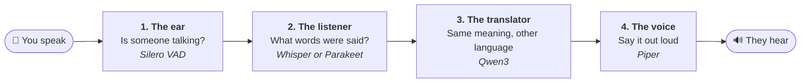

# The models: how they work, and how to add one

Volis doesn't understand speech by itself. It hands the work to **models**: files, trained
elsewhere, that each do one job very well. This page explains those jobs simply, then shows
how Volis finds its models and how to add new ones.

- To set Volis up, read [README.md](README.md). `setup.sh` downloads every model below for you.
- For how the code uses the models, read [ARCHITECTURE.md](ARCHITECTURE.md).
- To train a model for a dialect, read [DIALECTS.md](DIALECTS.md) and [lora.md](lora.md).

---

## 1. The four jobs, explained simply

Think of Volis as a small team of interpreters passing notes down a line:



1. **The ear** (voice activity detector, *VAD*). It doesn't understand words. It only notices
   *"someone's talking now… now they've stopped"*. It cuts the sound into sentences, so the next
   model gets whole sentences rather than a stream of noise.
2. **The listener** (speech recognizer, *ASR*). It hears a sentence and writes it down, like a
   stenographer. **Whisper** has to be told which language to expect. **Parakeet** works out the
   language itself, which is handy but can guess wrong on a short sentence.
3. **The translator** (*MT*, a small language model). It reads the written sentence and rewrites
   it in the other language. It's told to do only that: never answer, obey or comment on what
   it's given.
4. **The voice** (text-to-speech, *TTS*). It reads the translation aloud. Each voice speaks one
   language, and sometimes one accent: the Mexican Spanish voice sounds Mexican.

Each model is just a set of files on disk. Volis loads them into memory when you press
**Start**, and nothing is ever sent anywhere.

## 2. What's installed

| Job | Model | Folder | Comes from |
|---|---|---|---|
| The ear | Silero VAD | `models/vad/` | [sherpa-onnx ASR releases](https://github.com/k2-fsa/sherpa-onnx/releases/tag/asr-models) (`silero_vad.onnx`) |
| The listener | Whisper large-v3-turbo (int8) | `models/asr/whisper-large-v3-turbo/` | [sherpa-onnx ASR releases](https://github.com/k2-fsa/sherpa-onnx/releases/tag/asr-models) (`sherpa-onnx-whisper-turbo.tar.bz2`) |
| The listener | NVIDIA Parakeet TDT 0.6B v3 (int8) | `models/asr/parakeet-tdt-0.6b-v3-int8/` | [sherpa-onnx ASR releases](https://github.com/k2-fsa/sherpa-onnx/releases/tag/asr-models) (`sherpa-onnx-nemo-parakeet-tdt-0.6b-v3-int8.tar.bz2`) |
| The translator | Qwen3 1.7B (Q4_K_M) | `models/mt/` | [unsloth/Qwen3-1.7B-GGUF](https://huggingface.co/unsloth/Qwen3-1.7B-GGUF) (`Qwen3-1.7B-Q4_K_M.gguf`) |
| The voice: English (US) | Piper en_US lessac (medium) | `models/tts/vits-piper-en_US-lessac-medium/` | [sherpa-onnx TTS releases](https://github.com/k2-fsa/sherpa-onnx/releases/tag/tts-models) |
| The voice: Spanish (Spain) | Piper es_ES carlfm (x_low) | `models/tts/vits-piper-es_ES-carlfm-x_low/` | [sherpa-onnx TTS releases](https://github.com/k2-fsa/sherpa-onnx/releases/tag/tts-models) |
| The voice: Spanish (Mexico) | Piper es_MX claude (high) | `models/tts/vits-piper-es_MX-claude-high/` | [sherpa-onnx TTS releases](https://github.com/k2-fsa/sherpa-onnx/releases/tag/tts-models) |

`setup-models.sh` is the one place the download commands are written down. Model files come
with their own licences; check each one before you redistribute it.

Why these translator and listener models were chosen is recorded in
[TECHNICAL.md](TECHNICAL.md#choosing-the-translation-model).

## 3. How Volis finds its models: the folder is the index

There's no registry, database or download screen. Volis looks in the `models` folder next to
the program, and **whatever is there is what it has**:

```
volis.exe
volis.toml
models/
  vad/silero_vad.onnx                    the ear: one file
  asr/<one folder per listener>/         engine.toml + its files
  mt/<exactly one>.gguf                  the translator: one file
  tts/<one folder per voice>/            engine.toml + its files + espeak-ng-data/
```

Rules that keep it simple:

- **One folder per model**, named after the model. Files keep the names they were published
  with; nothing is renamed or hashed. You can tell what's what by looking in Explorer.
- **Adding a model** means dropping a folder in and pressing **Rescan models and devices** (or
  restarting). **Removing one** means moving its folder out.
- `models/mt/` holds **exactly one** `.gguf`. Two is an error that asks you to remove one,
  rather than Volis guessing.
- Folders under `asr/` and `tts/` describe themselves in an **`engine.toml`**. A folder without
  one is skipped, with a warning in the log.

### `engine.toml`, line by line

Think of it as the label on a jar: what's inside and what it's for.

```toml
name = "Piper es_MX claude (high)"   # what the window shows
kind = "segment"                     # works on whole sentences ("stream" is future work)
backend = "vits"                     # which engine runs it: whisper | nemo_transducer | vits
languages = ["es"]                   # languages it can hear or speak
varieties = ["es-MX"]                # optional: the dialect it's tuned for
data_dir = "espeak-ng-data"          # voices only: the pronunciation folder

[files]                              # job = file name, exactly as published
model  = "es_MX-claude-high.onnx"
tokens = "tokens.txt"
```

The `[files]` jobs depend on the backend:

| Backend | Used for | Files it needs |
|---|---|---|
| `whisper` | Whisper listeners | `encoder`, `decoder`, `tokens` |
| `nemo_transducer` | Parakeet listeners | `encoder`, `decoder`, `joiner`, `tokens` |
| `vits` | Piper voices | `model`, `tokens`, plus `data_dir` |

Only the keys shown above are allowed. A misspelt key, an unknown backend, a missing file, or
a variety Volis doesn't know makes the model show as **broken** or **DISABLED** in
`--report`, with the reason. It is never silently ignored.

## 4. How Volis picks a model

**Listener:** the **Recognizer** setting in the window picks one for Take turns, Listen
continuously and Paired. In Shared machine mode, each person has their own **Heard by** picker,
listing only listeners that know that person's language. Leave **Best match** if unsure.

**Voice:** chosen from the language you translate into. Nothing to set, unless you want to:
Shared machine mode has a voice picker per side.

**When more than one model fits**, Volis sorts them, and takes the first unless you choose:

1. **Tuned:** made for exactly the dialect you picked (for example *Spanish (Mexico)*).
2. **General:** knows the language, with no dialect declared.
3. **Tuned for another dialect:** labelled, so you don't pick it by accident.

Pickers show this as a label next to each name: *"tuned for Spanish (Mexico)"*, *"general"*.

### Dialects (varieties), in plain words

A language setting can include a region: `es` is "Spanish", `es-MX` is "Spanish (Mexico)".
In the window, that's the **Variety** dropdown under each language. Choosing one does two
things:

- **Models tuned for it are offered first** (the order above).
- **The translator is asked to write the way someone from there would say it**, not in the
  formal textbook standard.

The listener is only ever told the language (`es`), never the dialect. A dialect helps
recognition by *which* listener hears you: install one trained on that dialect, label it, and
it comes first.

**The limit, plainly:** asking a small translator for Iraqi Arabic changes its wording, but it
doesn't reliably produce Iraqi Arabic. A translator trained on dialect text is what fixes that;
see [DIALECTS.md](DIALECTS.md).

## 5. Checking your models

**`--report`** lists every model Volis found, whether each file is there, what it's tuned for,
and why anything is broken. Run it after any change:

```bash
./target/release/volis.exe --report
```

(On Linux, drop the `.exe`.) Every listener and voice should say `ok`.

**Compare recognizers** (in the window) or **`--listen --compare`** (in a terminal) runs every listener
on the same sentence and shows the results side by side, with how long each took. Use it to
pick the listener that hears *your* voice best. Published accuracy scores don't predict this:
accents, microphones and rooms all differ. Whisper always pads a sentence to 30 seconds inside,
so a short sentence costs it about as much as a long one. Timings are shown with the
sentence's length for that reason.

## 6. How to add a model

After each recipe, run `--report` (it should say `ok`), then press **Start** and try a sentence.
Make changes in `target/release/models/`, the copy Volis actually runs from. The `models/`
folder in the repository holds only the `engine.toml` files, as templates.

### Add a voice

1. Download a Piper voice from the
   [sherpa-onnx TTS releases](https://github.com/k2-fsa/sherpa-onnx/releases/tag/tts-models)
   (names start `vits-piper-`).
2. Extract it into `target/release/models/tts/`, so it's in a folder of its own.
3. Copy an existing voice's `engine.toml` into that folder. Change `name`, `languages`, the
   `model` file name, and `varieties` if it has an accent (for example `["es-MX"]`), or remove
   that line.
4. Run `--report`. No code change is needed. It appears in the voice pickers, and is chosen
   automatically when it fits best.

### Add a listener (recognizer)

- **A ready-made sherpa-onnx model** (Whisper or Parakeet family): extract it into a folder under
  `target/release/models/asr/`, and copy the matching `engine.toml` from an existing listener.
  Change `name`, `languages` and the `[files]` names to match the files you have.
- **A Whisper model from Hugging Face**, including one tuned on your own recordings: use the
  separate [model-converter](https://github.com/Cvio/model-converter) project. It converts
  the model, checks the conversion, and writes the folder and its `engine.toml` for you.

Then use **Compare recognizers** to check it hears you better than the one you have, before
switching to it.

A listener of a *different* kind (not Whisper or Parakeet) needs code: see
[ARCHITECTURE.md → Add a recognizer backend](ARCHITECTURE.md#add-a-recognizer-backend).

### Swap the translator

1. Move the current `.gguf` out of `target/release/models/mt/`, somewhere safe, so you can
   switch back.
2. Put the new one in. It must be a **Qwen3** model in GGUF format: the prompt is written for
   Qwen's chat format.
3. Restart Volis.

The translator has no `engine.toml` yet, so it can't declare a dialect. That's planned for when
a dialect-tuned translator exists.

### Add a language

1. **A listener that knows it.** Whisper knows most languages; add the code to its
   `engine.toml`'s `languages` list if it's missing.
2. **A voice that speaks it** (above).
3. **Teach Volis its name.** Add a row to the table in `src/varieties.rs`: the code, the name
   the window shows, and the name written into the translation prompt. The window only offers
   languages in this table, and the translator refuses any code it doesn't know rather than
   guess. This is the one step that needs rebuilding (`./setup.sh`).
4. Test a sentence each way.

### Add a dialect

1. Add a row for it to `src/varieties.rs`, below its language, for example `ar-IQ`,
   "Arabic (Iraq)", "Iraqi Arabic". Rebuild with `./setup.sh`.
2. Label any model tuned for it with `varieties = ["ar-IQ"]` in its `engine.toml`.
3. Pick it in the **Variety** dropdown. Tuned models now come first, and the translator is asked
   for that dialect.

To train the tuned models themselves, see [DIALECTS.md](DIALECTS.md) and [lora.md](lora.md).

## 7. Memory

All the models stay loaded while Volis runs. Shared
machine mode with two different Whisper listeners, or one Whisper used for two languages,
holds an extra copy of Whisper: about 1 GB more. The log prints the memory in use after each
listener loads (`memory in use after loading …`).
